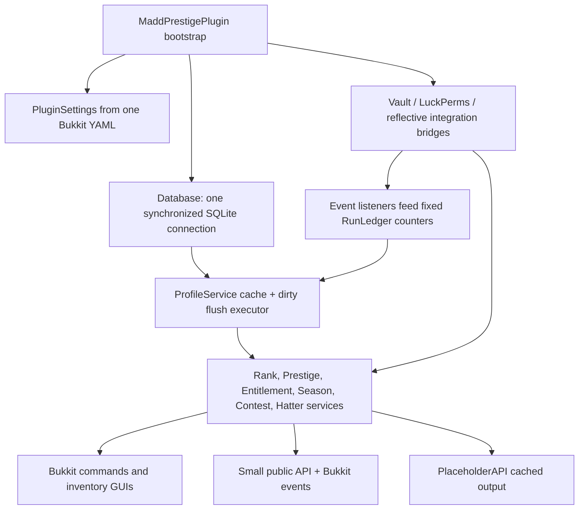
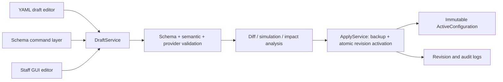

# MaddPrestige V2 — Phase 0 Repository Audit and Architecture Proposal

**Status:** Phase 0 complete; implementation intentionally not started  
**Audit date:** 2026-08-15  
**Authoritative specification:** `C:\Users\zhang\Downloads\MaddPrestige_V2_Master_Spec.md`  
**Kickoff instructions:** `C:\Users\zhang\Downloads\MaddPrestige_V2_Codex_Kickoff_Prompt.md`  
**Audited source:** `C:\Users\zhang\Documents\MC Development\MaddPrestige`  
**Audit-output workspace:** `C:\Users\zhang\Documents\ChatGPT\MaddKraft`

## Executive conclusion

MaddPrestige 1.2.0 is a functioning MaddKraft prototype, not a safe base to expose as the V2 public product without foundational changes. It has useful domain calculations, cached event aggregation, inventory UI patterns, basic SQLite persistence, a small API, and working reflective hooks for several installed plugins. Those parts justify an incremental modernization rather than discarding everything.

The current domain model, configuration, database, commands, and integration contracts are nevertheless fixed to one obsolete MaddKraft design. Four findings are immediate release blockers:

1. Startup calls LuckPerms `createAndLoadGroup` for configured progression and patron groups. This directly violates the authoritative V2 rule that MaddPrestige must never create missing groups.
2. The staff GUI uses one permission for both viewing and mutation, so a user allowed to open it can change profiles, configuration toggles, reload configuration, and flush data.
3. new-season conversion is non-idempotent and can add legacy stars once in SQL and a second time to cached players before saving them.
4. active YAML is written by Bukkit during startup and staff edits. It loses comments/order and converts dotted permission keys into nested sections; the current patron-entitlement reader then interprets the top-level `maddkraft` section as the integer value `0`.

Other high-risk gaps include hardcoded rank enums, unsafe QuickShop progression credit by default, incomplete crash recovery, no real schema migration chain, no player baselines or authoritative reconciliation, partial reload semantics, broad LuckPerms permission-prefix deletion, synchronous provider/DB work on the server thread, and a very small test suite relative to the behavior claimed in the documentation.

The recommended path is a staged replacement behind stable boundaries: preserve the current release as a migration input and behavioral reference, establish a generic core and persistence/config/provider foundations in Phase 1, then move one domain at a time. Do not patch V1 into production compliance piecemeal and do not run any legacy-data migration until Phase 9 qualification.

## Audit method and evidence limits

The master specification was read in full before the kickoff prompt, as requested. The audit then covered every main Java source file, all tests and resources, Maven metadata, bundled documentation, release JAR contents, runtime-test configuration/database/logs, and installed integration JAR descriptors and relevant public class signatures.

No source file in the audited repository was changed. Build and dependency resolution ran against a temporary copy. The only executable artifact added to the audit workspace is a query-only SQLite inventory helper; it was run against a temporary copy of the database.

Evidence examined:

- 47 main Java files, 4 test Java files, `config.yml`, and `plugin.yml`;
- `pom.xml`, README, changelog, API, compatibility, installation, relationship, and Tebex documents;
- release JAR `MaddPrestige-1.2.0.jar` and its embedded Maven/resource metadata;
- `runtime-test` Paper logs, installed plugin JARs, generated configuration, and `maddprestige.db`;
- public bytecode signatures for mcMMO, EconomyShopGUI, QuickShop-Hikari, UltimateMobCoins, GriefPrevention, LuckPerms, Vault, and PlaceholderAPI entry points;
- a clean Maven build and test run on Java 25.

The available runtime database is an empty test fixture: `PRAGMA integrity_check` returned `ok`, foreign-key check returned zero problems, schema version is 4, all player/progress/transaction/audit tables contain zero rows, and the only domain record is the active `chapter-1` season. No production database or LuckPerms export was available. Consequently, migration conclusions are based on code/schema inspection and must be validated later against anonymized production snapshots. This is a Phase 1 prerequisite, not permission to migrate anything.

## Current baseline

### Build and repository state

| Area | Observed baseline | Assessment |
|---|---|---|
| Build | Maven, one module, version 1.2.0 | Retain Maven initially; modularize deliberately |
| Java | `maven.compiler.release=25`; Temurin 25.0.3 available | Exact current baseline works; broad public compatibility is unresolved |
| Paper | API/runtime `26.1.2`, build 74 | Verified runtime target; compatibility range is undocumented |
| Main code | 47 Java files | Small enough to isolate and migrate incrementally |
| Tests | 4 classes / 7 tests | Build smoke coverage only, not release qualification |
| Git | source directory is untracked under parent repository `MC Development`; no MaddPrestige history was available | Must be corrected before implementation |
| CI/quality | no wrapper, CI, coverage, static analysis, dependency lock, or SBOM | Phase 1 foundation gap |
| Local DB testing | SQLite JDBC available through Maven | Works |
| MySQL testing | no Docker, MySQL/MariaDB client, or local service discovered | CI/container service must be provisioned |

The clean temporary-copy command `mvn clean verify` completed successfully. It compiled 47 main and 4 test sources, ran 7 tests with zero failures/errors/skips, and produced the shaded JAR. Warnings included a deprecated API use in `MenuService`, Java 25 native-access warnings from SQLite, an absent SLF4J provider in tests, and an overlapping shaded `META-INF/MANIFEST.MF`. The release JAR in `dist` and the user-supplied Downloads JAR are byte-identical (SHA-256 `1DE0B772EF11DE8DD1F70DFDA71E65CB307CCE5D47EEBA4AF26205EDA36A3A08`).

### Current runtime stack evidence

The most recent retained runtime log shows MaddPrestige enabling and disabling cleanly on Paper `26.1.2-74-e4e17fc` with LuckPerms 5.5.58, VaultUnlocked 2.20.2, mcMMO 2.2.053, PlaceholderAPI 2.12.2, QuickShop-Hikari 6.2.0.11, UltimateMobCoins 2.1.0, GriefPrevention 16.18.7, and other server plugins. It registered the mcMMO, QuickShop, and PlaceholderAPI hooks. EconomyShopGUI 7.0.0 failed to load because EconomyShopGUI itself could not parse the Paper version string, so MaddPrestige correctly skipped that hook. EconomyShopGUI 7.2.0 is available in Downloads but was not represented by a retained full-stack boot log.

This proves one historical smoke boot, not compatibility qualification. The runtime folder contains many unrelated third-party warnings/errors, and there is no automated full-stack assertion or repeatable test harness.

### Current dependency graph

| Dependency | Compile declaration | Observed runtime/download | Risk |
|---|---:|---:|---|
| Paper API | `26.1.2.build.74-stable`, provided | build 74 | exact vendor/build pin; no range policy |
| LuckPerms API | 5.5, provided | 5.5.58 runtime; 5.5.71 downloaded | API use works, behavior is unsafe |
| VaultAPI | 1.7.1, provided | VaultUnlocked 2.20.2 | old API contract, implementation must be matrix-tested |
| PlaceholderAPI | 2.11.6, provided | 2.12.2 runtime; 2.12.3 downloaded | compile/runtime drift; current surface is simple |
| SQLite JDBC | 3.50.3.0, shaded | bundled in 14.6 MB JAR | native/classloader warnings; no relocation/isolation policy |
| JUnit Jupiter | 5.13.4 | test only | adequate unit framework, insufficient harness |
| mcMMO and other hooks | no compile dependency; reflection | versions above | avoids hard linkage but gives no compile-time compatibility guarantees |

### Current architecture map



Bootstrap manually constructs all services. The domain and platform APIs are tightly coupled to Bukkit types and a fixed enum/counter model. `Database` is a 907-line SQL gateway responsible for schema creation, player state, seasons, contests, transactions, audits, and pending patron grants. `PluginSettings` is a 496-line parser for a 515-line monolithic YAML file. There is no dependency injection boundary, repository interface, provider registry, schema registry, or operation engine.

### Current command, GUI, config, and storage inventory

Public commands:

- `/rankup [confirm]`;
- `/prestige [menu|settings|confirm|rewards|buy|top|history]`;
- `/season [status]`;
- `/maddhatter [top|history|claim]`.

Administrative command aliases `/maddprestige`, `/mprestige`, and `/mp` expose `reload`, `gui/menu`, `inspect`, `setprestige`, `addtea`, `progress`, `flush`, `season`, `contest`, `hatter`, `patron`, and manual transaction `recovery` operations.

Player GUI pages cover rank, prestige, rewards, season, MaddHatter, and settings. Staff pages cover a dashboard, compatibility list, online-player list, and profile editor. Size, selected slots/materials, and page titles are configurable, but much of the label/lore content is hardcoded.

The monolithic YAML contains database, integration flags, a 38-provider compatibility catalogue, command relationships, GUI layout, fixed progression ranks, prestige values, fixed rewards, patron tiers, season rules, MaddHatter rules, and messages. It has no schema version or revision ID.

SQLite tables are `schema_info`, `player_lifetime`, `player_season`, `run_ledger`, `player_preferences`, `seasons`, `prestige_transactions`, `hatter_contests`, `hatter_scores`, `hatter_holder`, `hatter_history`, `pending_patron_grants`, and `admin_audit`.

## Severity-ranked findings

| ID | Severity | Finding | Evidence / consequence |
|---|---|---|---|
| F01 | Critical | MaddPrestige creates LuckPerms groups | `MaddPrestigePlugin:94-99` collects progression and patron groups; `LuckPermsBridge:146-151` calls `createAndLoadGroup`. Obsolete/mistyped groups can be created merely by booting. |
| F02 | Critical | Staff GUI view permission authorizes mutation | `gui.staff-permission` defaults to `maddprestige.admin.gui`; the same GUI performs reload, flush, config toggles, and player edits. This bypasses the granular command permissions. |
| F03 | Critical | season migration can duplicate legacy stars | `SeasonService:56-58` converts all rows in SQL, then `ProfileService:116-121` adds the same conversion to cached players. The SQL update itself is rerunnable. |
| F04 | Critical | configuration writes corrupt intended round-trip semantics | Startup calls `copyDefaults(true)` and `saveConfig`; staff edits save directly. Comments/order are lost and dotted patron permission keys become nested. `readIntMap` then reads `maddkraft` as zero. |
| F05 | High | fixed obsolete ranks are Java constants | `ProgressionRank` hardcodes `CURIOUS`, `ODD`, `MAD`, `UNBOUND`; rank/prestige, DB parsing, tests, commands, and UI depend on them. |
| F06 | High | consequential operations are not crash-safe | Rank-up has no pending journal. Prestige has one transaction row but no per-action checkpoint/idempotency. External command actions cannot be proven exactly once. |
| F07 | High | schema versioning can falsely label a database current | schema creation uses `IF NOT EXISTS`, adds only two known columns, then unconditionally upserts version 4. No ordered migrations, checksum, backup, dry-run, or report exists. |
| F08 | High | QuickShop player-to-player volume is progression credit by default | default weight is 0.25. Cycling funds can satisfy `serverEarnings`; this violates the V2 default policy. |
| F09 | High | no baseline/reconciliation model | mcMMO and income events only increment a fixed ledger. Restarts, missed events, provider changes, imports, and absolute values cannot be reconciled authoritatively. |
| F10 | High | reload can leave mixed old/new state | configuration is reloaded before full validation, active `settings` changes before every service reload completes, bridges/hooks are not reconstructed, and disk config has already replaced the prior file. |
| F11 | High | LuckPerms mutation scope is broader than safely proven | progression removal is usefully allowlisted, but target existence is not validated; relationship cleanup accepts configurable prefixes; patron ownership and MaddHatter metadata are hardcoded; failures are often swallowed. |
| F12 | High | API/event progress has no trusted provenance | any plugin can call the public progress API or fire the event with a spoofed source. There is no registered-provider identity or source policy. |
| F13 | High | command actions execute as console under a blocklist model | only a few roots are blocked by default. A compromised/mistaken config can run powerful commands, and arbitrary reflective event hooks can trigger them/progress. |
| F14 | High | permission failure can silently desynchronize competition holder state | Hatter transfer mutates old LP state, DB state, then new LP state, ignoring some failures and relying on compensation. |
| F15 | Medium/High | state/cache concurrency has races and unbounded structures | unload/rejoin can race an asynchronous save, executor shutdown is not awaited, contest totals are read across threads without a coherent snapshot, per-player locks are never evicted, and counters can overflow. |
| F16 | Medium/High | one SQLite connection and monolithic SQL block future backends | all DB methods synchronize on one connection; no repositories, dialect, pool, optimistic revision, or bounded write queue exists. |
| F17 | Medium/High | GriefPrevention adapter depends on structural implementation details | reflection accesses public `dataStore`, `PlayerData` setters, and save methods. Public visibility is not the same as a stable integration contract. |
| F18 | Medium | compatibility reporting overstates support | many entries only test installed/enabled state. Stale names such as EzATN, MaxCrates, and SilkSpawners_v2 remain; the giant `softdepend` list is not a supported-version matrix. |
| F19 | Medium | current docs overclaim behavior/test coverage | README says managed LP groups are auto-created (now prohibited) and claims broad automated coverage that 7 tests do not provide. |

## 1. Existing functionality worth preserving

Preserve the product intent, not its MaddKraft-specific identifiers:

- atomic-looking player actions with prechecks, clear success/failure messages, and compensating attempts;
- async profile loading, an in-memory UUID cache, and dirty-write batching so high-volume events do not write SQL individually;
- rank/prestige previews and confirmation for destructive prestige;
- player progress/reward/season/leaderboard/history views;
- staff inspection and compatibility-health concepts;
- maximum-based entitlement calculation as one configurable merge strategy;
- season/history, competition/history, persistent preferences, pending operations, and audit concepts;
- optional integrations that do not prevent core startup unless an active feature requires them;
- cached PlaceholderAPI output rather than a database query on each render;
- relationship token length, newline, recursion/depth, unresolved-token, and per-trigger count safeguards;
- database-path containment within the plugin data directory;
- UUID-first player identity and prepared SQL statements;
- external reward announcements after internal commit, with the existing warning that failure does not roll back the committed prestige.

These are useful behavioral seeds. Each must be re-expressed through generic IDs, typed providers, operation plans, and tested contracts.

## 2. Existing code/modules worth preserving or adapting

| Current area | Disposition | Adaptation required |
|---|---|---|
| `ProgressionMath` and pure requirement scaling math | Preserve/adapt | Generalize numeric types, rounding, scaling strategies, and per-requirement controls; add property/unit tests. |
| `PlayerState.snapshot/restore` idea | Adapt | Replace mutable fixed fields with immutable state plus version/revision and normalized child records. |
| `ProfileService` caching/dirty batching | Adapt | Add bounded queue, generation token, unload/rejoin ordering, retry/backpressure, clean shutdown barrier, metrics, and repository abstraction. |
| exact managed-group removal loop in `LuckPermsBridge.setProgression` | Preserve as an invariant | Make the managed set config-revision scoped, validate targets first, support offline users, preserve all unlisted groups, and return structured errors. |
| Vault response checks and compensation attempt | Adapt | Move behind cost actions with persisted operation/action states; distinguish unavailable from zero; use provider-supported precision. |
| `DatabaseTest` use of a real SQLite JDBC file | Preserve | Expand into migration/recovery/concurrency suites and backend contract tests. |
| inventory rendering/click-routing patterns | Adapt | Drive from schema/capabilities, localize all text, enforce per-action permission and preview/confirmation. |
| `CompatibilityService` registry concept | Adapt | Replace installed/enabled claims with provider capabilities, version compatibility, activation, and health. |
| `MaddPrestigeExpansion` cached-state pattern | Preserve | Expose generic stable IDs and diagnostic/progress placeholders; add an independently controlled PAPI input provider. |
| Bukkit pre/post events and immutable copied action map | Adapt | Version event contracts, add cancellable pre-events where safe, committed post-events, operation IDs, and documented thread context. |
| command token sanitizer and limits | Adapt | Use allowlisted action executors and explicit high-risk permissions; keep length/newline/unresolved/depth limits. |
| `HatterItemService` unique persistent-data marker idea | Adapt only if generic competition reward remains | Replace hardcoded identifiers/title with configured competition/reward IDs and operation ownership. |

Do not copy `Database`, `PluginSettings`, or bootstrap wholesale into new packages. Extract behavior through characterization tests, then replace their responsibilities incrementally.

## 3. Functionality to remove, replace, or redesign

Remove from generic core and defaults:

- Java enum ranks `ODD`, `MAD`, and `UNBOUND` and all assumptions that `UNBOUND` is the final stage;
- supporter/patron ownership and store-fulfilment logic for `knave`, `duchess`, `kingofhearts`, `whitequeen`, and `queenofhearts`;
- `MADDHATTER`, `MADNESS_COMPOSITE`, MaddHatter commands/permissions/meta/item tags as fixed concepts;
- `auction-listings` as a core entitlement name;
- Tea Leaves, Legacy Stars, Rabbit Holes, decrees, bosses, player shops, MaddKraft titles, costs, scaling, milestones, and branding as Java/default-profile constants;
- automatic LuckPerms group creation or hierarchy management;
- arbitrary YAML `event-class` and method-path reflection as the main extension mechanism;
- QuickShop/player-to-player transaction credit from safe defaults;
- the monolithic Bukkit `config.yml` writer and direct live mutation;
- broad static plugin compatibility catalogue and most `softdepend` entries for coexistence-only plugins;
- the no-op permission bridge returning success for mutations when LuckPerms is absent;
- manual database transaction status marking as the primary recovery workflow.

Redesign, rather than simply delete, seasons, competitions, entitlements, provider-fed counters, relationships, rewards, staff editing, and PlaceholderAPI. They are valuable generic features when configured and capability-driven.

## 4. Architectural problems and technical debt

The current system combines domain, persistence, integration, platform thread rules, configuration, and presentation in the same objects. Effects are executed directly while a service holds a JVM-local player lock. There is no immutable operation plan or durable action state, so correctness depends on no crash occurring between Vault, LuckPerms, SQL, and command dispatch.

Configuration has three representations with no common schema: YAML paths parsed manually, command-specific switches, and slot-specific GUI code. They can drift and cannot produce equivalent validation/diff/apply behavior. The current reload path is not transactional.

The fixed rank enum and fixed ledger/requirement records make arbitrary stages/providers impossible without replacing every layer. Database rows serialize those enum names, so code and storage are coupled. `Database` is a single synchronized connection and a god class. Provider hooks mutate service counters directly and have no capability metadata, source provenance, baseline, health semantics, or reconciliation.

Other debt includes manual service wiring, broad caught/ignored exceptions, stringly typed status/source/snapshot fields, duplicated UI text, coarse permissions, main-thread joins and writes, non-evicted locks/maps, insufficient shutdown coordination, no config/database revision relationship, no structured audit outcomes, and documentation that no longer matches behavior.

## 5. Hardcoded MaddKraft assumptions to remove from V2 core

The following belong only in a versioned `maddkraft` preset/profile:

- package/default descriptions and message prefix bearing MaddKraft branding;
- Curious/Odd/Mad/Unbound and the intended V2 Wanderer/Curious/Dreamer/Tea Guest/Wonderlander/Madcap ladder;
- old patron tiers and future supporter display names;
- MaddHatter title, metadata key/value, hat item identity, inactivity rule, composite weights, and contest commands;
- Tea Leaves/Legacy Stars labels and balances;
- homes, player-shop slots, claim blocks, Essentials/QuickShop permission patterns, and GriefPrevention mutation;
- EconomyShopGUI sale weight, QuickShop weight, mcMMO thresholds, costs, prestige fees, catch-up schedule, and scaling;
- Rabbit Holes, decrees, bosses, resource-world assumptions, Court/PvP concepts, and all milestone text;
- compatibility entries for the MaddKraft plugin inventory;
- relationship command templates and `maddkraft.*` permission/meta prefixes.

The Java core should know only immutable IDs, stage ordering, typed metrics, expressions, operation actions, currency/entitlement abstractions, and provider capabilities.

## 6. Migration risks for existing configuration and player data

1. There is no trustworthy migration origin marker. The schema version is forcibly set to 4 even if a legacy database only partially matches version 4.
2. `progression_rank` stores Java enum names. Obsolete or unknown values make `ProgressionRank.valueOf` fail; a display/group mapping cannot safely be inferred.
3. Old ranks do not map one-to-one to the new six-stage MaddKraft ladder. A migration must require an explicit mapping, including a decision for baseline/default users.
4. The available DB is empty, so row counts, invalid enums, duplicate UUIDs, negative balances, high values, and real transaction states remain unknown.
5. fixed columns (`tea_leaves`, perk levels, fixed ledger counters) need explicit disposition: map to configured IDs, archive as legacy facts, or intentionally discard with owner approval.
6. season legacy-star conversion is non-idempotent and may already have double-credited some data. Migration must detect rather than rerun it.
7. pending prestige transactions contain a semicolon-delimited partial snapshot and no per-action checkpoint. `PENDING` cannot tell whether Vault or LuckPerms already changed.
8. pending patron grants refer to obsolete supporter tiers and should not be fulfilled by V2 automatically.
9. config files differ and have been rewritten. Dotted permission paths are nested after save; unknown comments/order are lost. Migration must parse both intended and rewritten shapes.
10. IDs were previously display/enumeration values. V2 must assign immutable IDs and store an explicit mapping manifest with the migration revision.
11. monetary `REAL/double` values can have rounding artifacts; fixed integers can overflow at scale.
12. several history/audit/operation tables lack foreign keys, and schema constraints do not prevent negative or invalid enum/status data.

Required migration workflow: copy and checksum config/DB; integrity and semantic scan; read-only legacy adapter; explicit owner mapping; generated dry-run report with counts/exceptions; backup; migration on a disposable clone; restart and reconciliation tests; then a separately authorized maintenance-window run. Unknown/ambiguous records must stop or be quarantined—never guessed.

## 7. LuckPerms migration and synchronization risks

The most urgent correction is behavioral: V2 must replace `createAndLoadGroup` with read-only existence validation (`loadGroup`/`getGroup` after an appropriate load) and reject apply when any configured managed target is missing. A boot against old configuration must not create `odd`, `mad`, `unbound`, or old patron groups.

The current useful behavior is that progression updates remove only direct inheritance nodes whose names are in the configured progression map. Preserve this exact allowlist principle. Do not touch inherited memberships, contexts, temporary nodes, supporter/staff/specialist/event groups, hierarchy, weights, prefixes, or unrelated metadata. New MaddKraft supporter groups such as `mad_hatter` are parallel identities and must survive rank-up/prestige.

Additional risks and controls:

- current join reconciliation blindly projects the DB enum to LuckPerms for online users; V2 needs `warn-only`, `maddprestige-authoritative`, and one-time import modes, with `warn-only` recommended during migration;
- target groups and their contexts must be validated before any removal, so a bad mapping cannot strip the old stage and fail to add the new one;
- offline mutations must use `UserManager.loadUser`/save lifecycle safely, not `getUser` only;
- the no-op bridge must fail closed for active rank operations;
- a configuration revision must pin the managed group set used by an operation;
- permission-prefix cleanup must be replaced by explicitly owned nodes or a narrowly namespaced grant ledger;
- old patron groups must be read only if an explicit migration mapping requests it and must never be removed as progression;
- import ambiguity (multiple managed groups, none, contextual/temporary membership, mismatched stage order) must produce a report and require a policy;
- reconciliation must be idempotent, auditable, rate-limited, and safe across login/load races;
- LuckPerms storage outage, save future failure, and plugin disable during an operation must yield `NEEDS_RECONCILIATION`, not false success.

## 8. Dependency, API, and plugin-version risks

Retain Maven for Phase 1 to avoid an unrelated build-system migration. Add a Maven wrapper, reproducible compiler settings, dependency convergence/enforcer checks, checksums/SBOM, CI, and an explicit supported-version matrix.

Current `--release 25` and Paper 26.1.2 build 74 are verified in the available environment. Java 25 sharply limits public deployment compared with a lower LTS, but the installed Paper/mcMMO build also targets Java 25. The Phase 1 implementation baseline should remain Java 25/Paper 26.1.2 until the owner decides whether broader public compatibility warrants a separate lower-Java/Paper line.

The POM compiles against older PAPI than runtime, old VaultAPI against VaultUnlocked, and no direct APIs for most integrations. Reflection prevents classloading failure but silently turns method drift into lost progress. Every first-party adapter needs minimum/maximum tested versions, signature/capability probing, health state, and contract tests against real JAR fixtures. Unsupported versions should degrade only that provider.

The huge `softdepend` list implies support and controls load order even for coexistence-only plugins. Limit plugin metadata dependencies to actual runtime linkage/order requirements; discover other providers after server load. Optional adapters should be lazily initialized only when referenced.

SQLite is shaded without an isolation policy and triggers native-access warnings on Java 25. Evaluate Paper's library loader versus a deliberately packaged storage runtime; do not rely accidentally on server-internal library versions. Add dependency vulnerability scanning and licenses/notices before public release.

## 9. Current integration implementation assessment

| Integration | Current implementation | What is safe/useful | Required V2 change |
|---|---|---|---|
| LuckPerms | direct API, online user for progression, async offline load for patron/title, auto group creation | exact configured-group removal loop | never create groups; offline-safe rank projection; structured health/errors; explicit managed membership only; no patron ownership |
| Vault/economy | normal Bukkit service lookup; `double`; withdraw/deposit response checks; balance exceptions become zero | service abstraction and response checking | typed money, unavailable distinct from zero, capability/precision metadata, persisted cost actions, reconciliation; Vault is not an earnings ledger |
| mcMMO | reflective `McMMOPlayerXpGainEvent.getXpGained()` increments one total | installed event signature exists and avoids SQL per event | first-party adapter for authoritative power/skill/XP metrics and scoped deltas; baselines/reconciliation; document raw vs adjusted XP |
| PlaceholderAPI output | registered expansion reads cached state | no DB query per render | generic IDs, progress/why/provider-health placeholders, locale-safe formatting, API compatibility tests |
| PlaceholderAPI input | absent | none | separate requirement provider with parse/type rules, cached/scheduled sampling, health and fail-closed semantics |
| EconomyShopGUI | reflective successful `SELL` transaction, price × weight | 7.2.0 public event signature matches the reflection | authoritative server-faucet provider with source policy, dedupe/operation identity where available, version matrix; 7.0.0 runtime failed independently |
| QuickShop-Hikari | successful purchase total assigned to seller recipient × default 0.25 | installed 6.2.0.11 signatures and recipient logic are plausible | default zero; classify P2P; enable only with explicit exploit warning/source policy; never call it safe earnings by default |
| UltimateMobCoins | reflective BigDecimal receive event, optionally converted into server earnings | installed event exists and amount is BigDecimal | expose a separate configured currency/metric; do not merge into Vault earnings; provider precision and provenance |
| GriefPrevention | reflection through `dataStore`/`PlayerData` to change bonus claim blocks | feature can be isolated behind entitlement action | supported-version adapter or command/API provider; persisted exact grant ledger; verification/compensation; disable safely on drift |
| generic relationships | lifecycle console commands and reflective inbound events | tokens/limits and post-commit placement | remove arbitrary reflection; provider SDK/event API; allowlist-first command policy; operation/audit identity and uncertainty state |
| all other catalogue entries | installed/enabled report and optional commands, usually no API | inventory can inform a MaddKraft preset | label as coexistence, hook-available, or tested adapter; do not imply API compatibility |

mcMMO's installed `McMMOPlayerXpGainEvent` exposes integer adjusted XP and raw float XP. EconomyShopGUI 7.2.0 exposes transaction result/type/player/price. QuickShop's event stores the transaction total and tax; `getBalanceWithoutTax()` returns the total. UltimateMobCoins returns `BigDecimal`. These signatures validate current reflection paths, but not their semantic suitability as V2 progression metrics.

## 10. Proposed V2 module/package architecture

Use a Maven multi-module build producing one Paper plugin distribution plus a separately publishable API artifact:

```text
maddprestige-parent
├─ maddprestige-api             stable provider/API/events DTOs; minimal platform surface
├─ maddprestige-core            domain, requirements, stages, operations, config schema
├─ maddprestige-persistence     repositories, SQL dialects, migrations, backup/recovery
├─ maddprestige-platform-paper  bootstrap, scheduler boundary, commands, GUIs, PAPI output
├─ maddprestige-integrations
│  ├─ luckperms
│  ├─ vault
│  ├─ mcmmo
│  ├─ placeholderapi
│  ├─ economyshopgui
│  └─ optional adapters
├─ maddprestige-distribution    shaded/assembled Paper JAR and generated descriptors
└─ maddprestige-testkit         fake providers, fixtures, backend contracts, Paper harness
```

Suggested Java package responsibilities:

- `...api`: stable IDs, provider registration, capability descriptors, query/result contracts, pre/post events;
- `...core.model`: immutable player/stage/season/currency/entitlement value objects;
- `...core.requirement`: expression tree, typed comparisons, measurement scopes, scaling/catch-up, explanations;
- `...core.operation`: plans, actions, state machine, idempotency, reconciliation;
- `...core.service`: use cases, no Bukkit globals or SQL;
- `...config.schema`, `.document`, `.revision`, `.migration`: metadata, AST, validation, diff/apply/rollback;
- `...persistence.repository`, `.migration`, `.sqlite`, `.mysql`: backend boundaries and implementations;
- `...provider.registry`: lifecycle, capabilities, health, activation, provenance;
- `...platform.paper`: thread/scheduler adapter, command/UI/message layers;
- `...integration.<plugin>`: one plugin-specific adapter per package;
- `...observability`: diagnostics, audit, metrics, redaction.

The core must not import LuckPerms, Vault, mcMMO, PlaceholderAPI, or MaddKraft classes. Paper access should be concentrated in the platform module. Avoid a big-bang module move: add boundaries and characterization tests first, then migrate services behind them.

## 11. Proposed canonical configuration/schema architecture

Define every editable field once in a `SchemaRegistry`. A schema node contains canonical path, immutable field ID, type, default, description, examples, constraints, allowed values or dynamic capability source, sensitivity, risk, required edit/apply permission, hot-reload behavior, deprecation aliases, and migration transform. YAML, commands, GUI, API, validation, help, diff, and documentation all consume that registry.

Recommended file layout, following the master specification while separating secret-bearing connection settings:

```text
plugins/MaddPrestige/
  config.yml                 bootstrap, locale, active revision, safety policy
  database.yml               backend and redacted connection references
  progression.yml            stage definitions/order and rank adapter
  prestige.yml               availability, reset/preserve policies, caps
  requirements.yml           reusable requirement trees/scaling/catch-up
  rewards.yml                reward definitions/action policies
  currencies.yml             internal/external currency definitions
  entitlements.yml           sources, merge strategies, grants
  integrations.yml           provider instances, version/source policies
  seasons.yml
  competitions.yml
  messages.yml               message keys/formats, not translation corpus
  gui/
    player.yml
    staff.yml
    setup.yml
  lang/
    en_US.yml
  presets/
    generic-simple/          opt-in example, not silently active
    maddkraft/               flagship deployment profile
  drafts/<draft-id>/...
  revisions/<revision-id>/...
  backups/
  migration-reports/
```

Each document has `schema-version`; the active set has a content-hash revision manifest. Runtime services consume an immutable `ActiveConfiguration` compiled from all documents, never raw YAML. Immutable IDs should use a conservative namespace syntax such as lowercase `[a-z0-9][a-z0-9._-]{0,63}` and never be derived again from a display name after creation.

Unknown keys must be retained for forward compatibility where safe but reported. Duplicate IDs, missing references, stage cycles/order gaps, invalid provider metrics/operators, unsafe commands, missing LP groups, unavailable required providers, orphaned player IDs, and restart-required edits must be cross-file validation errors or explicit warnings. Values must not be silently clamped; the validator should state the bad value, rule, file/path, consequence, and correction.

Use a comment/order-preserving YAML document model. Phase 1 should spike and lock the round-trip library/strategy with golden-file tests before committing to it. Bukkit `FileConfiguration` must not be the canonical writer.

## 12. Proposed YAML, command, and staff-GUI configuration architecture

Functional parity means all three surfaces call the same services, not that each has separate mutation code:



YAML remains the complete representation. Commands offer both human workflows and generic schema operations, for example `config get`, `draft set`, `draft list/add/remove/move`, `validate`, `diff`, `apply`, `history`, and `rollback`. Tab completion is generated from schema types and live provider capabilities.

The staff GUI uses progressive disclosure: overview, stages, requirements, costs/rewards, providers, currencies/entitlements, seasons/competitions, UI/messages, diagnostics, draft review. Complex nested expressions can be built through typed child editors. Every edit remains in a named draft. Risky actions show exact stage/player/provider impact and require the appropriate permission plus confirmation. GUI close or disconnect cannot implicitly apply.

YAML file edits are imported into a draft on explicit reload/validate. Commands and GUI update the same comment-preserving document/typed overlay. Apply does the following under a configuration lock:

1. re-read and hash the draft;
2. validate schema, references, provider capabilities, LP group existence, data migration impact, and permissions;
3. compile a complete immutable candidate;
4. generate a human/machine diff and simulation;
5. create backup and revision metadata;
6. atomically activate files and runtime reference;
7. invoke bounded provider reconfiguration hooks;
8. if runtime activation fails, restore the last-known-good reference/files and record failure.

## 13. Proposed provider architecture

The registry should distinguish a provider type from a configured provider instance. Each provider has immutable ID, API version, implementation version, plugin dependency/version range, lifecycle, capabilities, thread requirements, and health. Health values are `NOT_INSTALLED`, `AVAILABLE`, `ACTIVE`, `INACTIVE`, `DEGRADED`, `UNSUPPORTED`, `UNAVAILABLE`, and `UNHEALTHY`; every state includes a reason and last transition.

Core contracts:

- `RankProvider`: validate mapping, read external projection, plan/apply/verify direct membership, reconcile offline/online state;
- `ProgressionProvider`: publish typed `MetricDescriptor`s and query `MetricSample`s with source time/revision and availability;
- `EconomyProvider`: balance/format/precision plus planned debit/credit actions;
- `CurrencyProvider`: internal or external balance and ledger actions by currency ID;
- `RequirementProvider`: predicates/metrics that do not fit numeric progression;
- `RewardProvider`: validate, plan, execute, verify, compensate/reconcile when supported;
- `EntitlementProvider`: source contributions and/or external grant projection;
- `ResetCapabilityProvider`: explicit, separately authorized reset actions;
- `CompetitionProvider`: optional scoring inputs, never a hardcoded title/domain.

`MetricDescriptor` declares stable metric ID, type (`INTEGER`, `DECIMAL`, `DURATION`, `BOOLEAN`, `ENUM`, `STRING`, `COUNT`, `CURRENCY`), unit, valid operators, whether authoritative absolute reads exist, event support, supported scopes, freshness, and cost. `MetricSample` returns value, observation time, provider generation, provenance, and a structured availability/error—not `0` for failure.

Providers do not mutate `PlayerState` directly. Event producers submit registered, authenticated `ProgressEvent`s to an ingestion service, which verifies provider identity and metric/source policy, deduplicates where possible, aggregates in memory, and persists checkpoints. Only configured capabilities activate listeners. Generic YAML reflection is removed; third parties register through the SDK.

Costs and rewards produce operation actions with explicit phase, thread executor, reversibility, idempotency support, verify/reconcile function, and redacted audit description. Rank projection is just another native action, but its narrow isolation rules are enforced in the LuckPerms adapter.

## 14. Proposed persistence architecture

Define repositories and a transaction unit independent of SQL dialect. SQLite remains the default single-server backend; MySQL/MariaDB implements the same contract. Keep single-server semantics until a tested network mode exists, but use optimistic state revisions and database uniqueness so multiple connections cannot silently double-commit.

Suggested normalized schema areas:

- `players(player_uuid, first_seen, last_seen)`;
- `player_state(player_uuid, stage_id, prestige_count, season_id, state_revision, scope IDs, timestamps)`;
- `scope_baselines(player_uuid, scope_type, scope_id, provider_id, metric_id, value, observed_at, provider_revision)`;
- `metric_aggregates` and `metric_latches` keyed by player/scope/provider/metric;
- `stage_history` and `prestige_history` with operation/config revision IDs;
- `currency_accounts` and append-only `currency_ledger` using exact decimal representation;
- `entitlement_contributions` and `entitlement_projection`;
- `operations` and `operation_actions`;
- `seasons`, `season_history`, generic `competitions`, `competition_scores/history`;
- `config_revisions`, `migration_history`, and `audit_log`;
- optional `provider_checkpoints`/event dedupe records.

Use UUIDs and immutable string IDs, foreign keys, check constraints, explicit UTC timestamps, prepared parameters, and indexes for player lookups, pending operations, history, leaderboards, and audit queries. Store exact decimal amounts as canonical decimal strings/DECIMAL appropriate to backend rather than binary `double`. Use `BIGINT` with checked arithmetic for counts.

Implement deterministic ordered migrations with version, checksum, description, backend compatibility, applied timestamp, and result. Never overwrite a version marker simply because tables exist. Before migration: validate current version/checksum, acquire backend lock, create and verify backup, dry-run/plan, then migrate transactionally where the backend permits. Record statements/row counts without secrets. Destructive or non-transactional DDL needs a staged copy/swap plan and explicit diagnostics.

SQLite specifics: WAL, foreign keys on, busy timeout, one serialized write coordinator, bounded queue/backpressure, read connections if justified, checkpoint/backup coordination, and no long server-thread calls. MySQL/MariaDB: dedicated pool owned by the plugin, connection/read/write timeouts, transaction isolation documented, health probes, dialect-tested DDL/upsert, and retry only for proven safe/idempotent boundaries.

## 15. Proposed transaction, crash-recovery, and duplicate-protection architecture

Every consequential action builds an immutable `OperationPlan` containing operation UUID, type, actor, target, expected player state revision, config revision, provider generations, requirements/cost validations, ordered internal/external actions, and redacted preview.

Recommended states:

```text
PLANNED -> PREPARED -> EXECUTING -> STATE_COMMITTED -> COMPLETED
                         |                 |
                         v                 v
                 COMPENSATING     NEEDS_RECONCILIATION
                         |
                         v
                 COMPENSATED / FAILED
```

Per-action states are `PENDING`, `STARTED`, `SUCCEEDED`, `VERIFIED`, `FAILED`, `COMPENSATED`, or `UNCERTAIN`. Persist transitions and attempt metadata. Within one DB transaction, insert `PREPARED` with a unique idempotency key and compare-and-set the expected player revision. Native internal state/currency/history changes commit atomically. Provider actions run in their declared order and are verified. Post-events and announcements occur only after authoritative state commit.

Duplicate protection:

- unique `(operation_type, target_uuid, idempotency_key)` constraints;
- player state revision/CAS, not just a JVM lock;
- provider action keys derived from operation/action ID;
- append-only currency/reward ledgers with unique operation-action references;
- event source dedupe IDs/checkpoints where supplied;
- in-memory click debounce as UX only, never the correctness mechanism.

On startup, a recovery coordinator claims incomplete operations, checks stored action state and current provider reality, and decides resume, verify/complete, compensate, or `NEEDS_RECONCILIATION`. It must not blindly rerun a Vault withdrawal, LuckPerms save, item command, or reward. Native provider APIs should accept operation IDs where possible. Generic console commands remain inherently uncertain across a crash; mark and expose that uncertainty instead of claiming exactly-once delivery.

## 16. Proposed player-state, snapshot/baseline, history, and reconciliation architecture

Authoritative player state should contain only stable identity and current domain facts: UUID, stage ID, prestige count, active season, current scope IDs, exact internal currency account references, state revision, and timestamps. Display names, group names, icons, and balance numbers remain configuration/provider data.

Create explicit scopes with UUIDs/IDs for lifetime, season, prestige run, and stage attempt. On scope entry, capture baselines for configured metrics that support absolute reads. A requirement evaluates `current - baseline` for delta scopes, absolute `current` for live scopes, or an event aggregate tied to the scope. Latched completion stores the completion record with target/config revision/evidence; live completion is recalculated. Changing provider/config invalidates or migrates baselines only through a reviewed plan.

Event-fed metrics need periodic checkpoint persistence and, when an authoritative absolute source exists, reconciliation against that source. Reconciliation results are `MATCH`, `REPAIRED`, `MISMATCH_REPORTED`, `UNAVAILABLE`, or `AMBIGUOUS`, with audit evidence. Never add absolute totals to accumulated deltas without a recorded baseline.

History is append-only for stage transitions, prestige, currency mutations, entitlements, manual edits, seasons, competitions, and reconciliations. Store operation/config revision and provider evidence so `/why` can explain current state and staff can reconstruct an outcome. Retention/archival is configurable, but core financial/operation audit should not be silently discarded.

## 17. Proposed public API and provider SDK architecture

Publish `maddprestige-api` independently with semantic versioning and a compatibility policy. Avoid exposing mutable implementation objects, JDBC, Bukkit configuration, or internal service classes.

Minimum API surface:

- query immutable player/stage/prestige/currency/entitlement snapshots;
- evaluate a requirement or rank/prestige eligibility and receive an explanation tree;
- simulate an operation without mutation;
- submit manual progress only through a registered provider handle/capability;
- register/unregister providers with owner plugin identity and lifecycle;
- inspect provider capabilities/health;
- request an operation through the service layer with authorization context;
- subscribe to documented pre/post/recovery/config/provider-health events.

Provider registration returns an opaque handle bound to the registering plugin and provider ID. The registry rejects ID conflicts, incompatible API versions, invalid capability metadata, and events from stale/unregistered generations. Calls declare thread requirements and return `CompletionStage`/structured results where asynchronous. Every result distinguishes unavailable, invalid, denied, conflict, and failed states.

Events should include operation/config revision IDs and immutable old/new snapshots. Cancellable pre-events occur before preparation only where cancellation is safe; committed post-events cannot be used to undo state. Document ordering, server thread, reentrancy, timeout, and exception isolation. Include example progression, economy/currency, requirement, and reward providers in the testkit/docs.

## 18. Proposed permissions, security, and audit-logging architecture

Separate observation, draft edit, apply, rollback, player mutation, force, migration, reconciliation, simulation, provider debugging, and sensitive database actions. The owner wildcard may aggregate nodes, but ordinary staff roles should not require OP.

Recommended families include:

- `maddprestige.use`, `.rankup`, `.prestige`;
- `maddprestige.admin.gui` and `.doctor`;
- `.admin.config.view`, `.edit`, `.apply`, `.rollback`;
- `.admin.players.view`, `.progress`, `.stage`, `.prestige`, `.currency`, `.entitlements`;
- `.admin.integrations.view`, `.reconcile`;
- `.admin.simulate`, `.migrate`, `.recovery`, `.debug`;
- a distinct high-risk node for external command actions and secret/database configuration.

Every schema node/action declares its permission and risk level. Commands and GUI recheck permission at execution, not merely menu open. Console identity is explicit. Force operations still validate structural safety and require a reason.

Audit records include UTC timestamp, actor UUID/name/type, target, operation ID, config revision, provider/action, old/new values, source surface, reason, outcome, failure/uncertainty, and correlation ID. Use append-only DB rows with indexed retention/export, plus concise redacted structured logs. Never record DB passwords/tokens or raw secret config diffs. Name changes do not replace UUID identity.

Security boundaries: no arbitrary class/method reflection or SQL from YAML; no unrestricted filesystem paths; no dynamic untrusted code loading; strict MiniMessage/command token handling; allowlist-first command actions; narrow LP ownership ledger; plugin API provenance; rate limits; bounded inputs; and remote/web control disabled unless a later phase explicitly designs/authenticates it.

## 19. Proposed setup, diagnostics, `/doctor`, `/why`, simulation, help, and usability architecture

Fresh install must start safely with no active progression. `/maddprestige setup` creates a draft and guides the owner through deployment type, backend, baseline/final stages, rank adapter, existing LP group validation, simple requirements/costs/rewards, locale/UI, preview, validation, and apply. It may import a preset, but never create external ranks or silently activate unsafe provider metrics.

`/doctor` reads the same diagnostics registry used by startup and GUI. It should summarize active/config revision, DB version/connectivity/queue, pending operations, backup/migration state, provider installed/available/active/health/version, LP missing/mismatched stages, stale baselines, unsafe actions, and configuration warnings. Player-visible output is concise; staff debug output includes correlation IDs and remediation without secrets.

`/why [player] [rankup|prestige|operation]` returns an explanation tree: satisfied/blocking/unavailable requirements, current/target/unit/scope/completion mode, cost affordability, provider health, stage rule, and the exact next action. The same object renders in commands, GUI, API, and PAPI summaries.

Simulation builds a real immutable operation plan with all intended state changes, LP membership delta, costs, rewards, resets/preserves, command uncertainty, provider health, and config revision, then discards it. Staff can simulate configuration impact across stored player states with bounded pagination/sample modes before apply.

Help is schema/capability generated and contextual. It explains terms in plain language, shows only authorized/available actions, links errors to suggested commands, and uses stable message keys with localized MiniMessage. Error messages carry what failed, why, whether anything changed, recovery state, and correlation ID.

## 20. Proposed PlaceholderAPI architecture

Split output and input responsibilities:

- output expansion reads immutable cached projections only; no DB or network call per placeholder render;
- input requirement provider evaluates configured external placeholders on a controlled schedule/thread, parses them into declared metric types, caches freshness/error, and fails closed when missing/unparseable/stale.

Generic output examples should be based on immutable IDs: stage ID/display/index, next stage, prestige count, named currency balance, named entitlement, requirement progress/percent/state, can-rankup, blocking count/summary, active season/competition, provider health, and config revision. MaddKraft aliases can live in its preset with deprecation notices.

Dynamic parameters must be bounded and validated; never expose secrets or arbitrary config paths. Formatting is locale-aware and MiniMessage-safe. Offline behavior is explicit: serve a cached snapshot with age, return unavailable, or use an asynchronously prefetched projection—never block the render thread on SQL/provider access. Add load tests proving A52 and failure tests for A53.

## 21. Proposed configuration revision, validation, migration, backup, diff, apply, and rollback architecture

A configuration revision is an immutable manifest containing revision UUID, parent, schema versions, per-file content hashes, created/applied timestamps, actor, source surface, validation report, diff summary, compatibility impact, and optional migration plan. The active revision pointer is the only runtime switch.

Validation layers:

1. YAML syntax and document schema;
2. field type/range/format/deprecation;
3. cross-document references and immutable-ID uniqueness;
4. domain invariants such as stage order, reset target, requirement operator/type, currency precision, and entitlement merge rules;
5. provider capability/version/health checks;
6. external validation such as existing LuckPerms groups;
7. persistence impact: orphaned player IDs, baseline invalidation, operation/config revision compatibility;
8. safety/permission/restart policy.

Classify findings as error, acknowledgement-required high-risk warning, warning, or information. Apply is impossible with errors and requires an authorized explicit acknowledgement for high-risk warnings.

Diffs are semantic as well as textual: added/reordered/deleted stages; group mapping changes; requirement target/formula changes; reset/preserve changes; provider activation; currency/entitlement changes; permission/command risk; affected stored-player counts; and restart requirements. Secrets are redacted.

Before apply, create a verified filesystem backup and DB metadata record. Write files to a new revision directory, flush, and atomically replace the active manifest/pointer. Compile and activate the candidate as one immutable unit. Keep a configured number of revisions and never delete the only recovery copy. Rollback is a new auditable revision based on old content; if the intervening data shape makes it unsafe, require a generated data migration/reconciliation plan rather than swapping files blindly.

Legacy migration uses a separate importer, never normal config load. It recognizes exact legacy shapes/versions, preserves the original unchanged, converts deterministic fields, flags obsolete ranks/groups/terms, and asks for explicit mappings where ambiguous. It emits before/after hashes, decisions, warnings, row counts, and rollback instructions.

## 22. Proposed test infrastructure and testing strategy

Keep JUnit 5 and the real SQLite JDBC tests, then add layers:

- pure unit tests for immutable IDs, stage validation/order, expression trees (`ALL`, `ANY`, `ANY_X`, weighted/nested), typed operators, scaling, catch-up, baseline math, live/latched completion, entitlement merges, currency precision, operation state machine, permissions, schema metadata, diffs, and provider registry;
- golden YAML round-trip tests proving comments/order/unknown keys and all three admin surfaces compile to the same model;
- property/fuzz tests for expression evaluation, scaling/rounding, ID parsing, command tokens, and migration input;
- repository contract tests run against SQLite and MySQL/MariaDB;
- migration fixtures for every old schema/config shape, corrupt/partial version, dotted-key rewrite, obsolete ranks/groups, pending operations, and rollback/backup failure;
- transaction fault injection after every persisted/action boundary, with restart reconciliation assertions;
- provider contract tests using pinned real JAR fixtures or test plugins for LuckPerms, Vault, mcMMO, PAPI, EconomyShopGUI, QuickShop, UltimateMobCoins, and GriefPrevention;
- Paper integration tests for startup, setup, commands, permissions, GUI click flows, scheduler/thread rules, plugin enable/disable/reload, and full-stack coexistence;
- concurrency/load tests for rapid events, duplicate clicks, join/quit/rejoin, shutdown with dirty data, queue saturation, leaderboard queries, and PAPI rendering;
- security tests for malicious YAML, reflection/class paths, command injection, MiniMessage, permissions, path traversal, API spoofing, and secret redaction.

CI should use the Maven wrapper, Java 25 initially, a pinned Paper test runtime, ephemeral SQLite, and containerized MySQL/MariaDB. Docker and a MySQL/MariaDB service are absent in the current local environment, so this backend harness must be provisioned in CI or installed before Phase 1 database contract tests can pass.

Treat all master-spec tests A01–A76 as traceable release gates. Map each to automated test IDs where possible and retain a small documented manual matrix for visual/third-party behavior. Phase gates run their relevant subset, while release qualification runs all. Add coverage reporting, static analysis, dependency convergence/vulnerability checks, and reproducible artifact/hash verification. A successful `mvn verify` alone is not acceptance.

Current test gaps are substantial: there are only two `PluginSettings` tests, two `PlayerState` tests, two `Requirements` tests, and one broad `Database` test. They do not test LuckPerms isolation/group creation, Vault failures, commands, permissions, GUIs, PAPI, reload, provider versions, season double conversion, concurrency, crash boundaries, MySQL, or full Paper startup.

## 23. Security risks

Highest-priority current risks:

- automatic LuckPerms group creation changes an external authorization system from configuration alone;
- one staff-GUI permission authorizes sensitive mutation;
- relationship commands execute as console under a narrow denylist;
- configurable reflective event/method paths expand the trusted configuration surface;
- broad configurable LuckPerms cleanup prefixes can delete nodes MaddPrestige did not create;
- public API/event progress has spoofable source identity;
- errors are sometimes swallowed, hiding permission/projection failure;
- no revisioned approval/second look exists for destructive config changes;
- audit data omits actor UUID in some paths, config revision, complete old/new values, and uncertainty;
- future external DB secrets have no redaction/storage design yet.

Positive current controls include prepared SQL, normalized in-folder database path validation, some command token limits, permission checks on command paths, and post-commit external relationship actions. Preserve and strengthen them.

## 24. Concurrency and thread-safety risks

Current operations rely on per-player `ReentrantLock`s, but the lock maps never evict and protect only one JVM. Vault, LuckPerms future joins, database saves, and parts of command/GUI action flow can block the Paper main thread. `ProfileService` serializes async DB work but has a quit/rejoin race: it removes cached state, schedules a save, and a new load can occur before that save completes. Shutdown starts executor termination without awaiting every queued unload write.

Contest score accumulators are mutated/flushed across threads without one immutable snapshot around total/reached-at, so leaderboard/state observations can race. Dirty progress is kept in memory until a flush and is lost on process crash within that window. Mutable `RunLedger` escapes from `PlayerState`, weakening the apparent synchronization boundary.

V2 controls: platform scheduler abstraction; explicit main-thread-only provider actions; asynchronous repositories; immutable snapshots; per-player serial operation coordinator plus DB CAS; bounded queues; generation tokens for cache load/unload; shutdown barrier with timeout/recovery; atomic accumulators or actor-style aggregation; safe lock eviction; and race/load tests. Folia compatibility should be an explicit future capability, not implied by ordinary Paper correctness.

## 25. Performance and scalability risks

The current no-write-per-event cache is a good baseline. Risks are the single synchronized SQLite connection, synchronous rank/prestige saves, startup scan/log of many plugins, relationship command fan-out, unbounded player locks/contest maps, and leaderboard loading of up to 10,000 rows into memory. Reflection per event adds overhead and hides allocation/type failures. PAPI output is appropriately cached.

V2 should define budgets for event ingestion, server-thread operation time, DB queue size/latency, flush batch, recovery scan, GUI query page, and PAPI render. Add indexes and keyset pagination for history/leaderboards, bounded caches with eviction, batched upserts/checkpoints, provider activation only when used, sampled/rate-limited diagnostics, and metrics visible in `/doctor`. Apply backpressure by rejecting/degrading noncritical input before unbounded memory growth. MySQL support does not by itself make multi-server progression safe.

## 26. Data-integrity risks

The largest known integrity defect is duplicate legacy-star conversion. Other risks include version-marker overwrite, unknown enum failure, partial rank/prestige/entitlement/Hatter actions, binary floating money, unchecked integer growth/casts, missing foreign keys/check constraints, unstructured snapshot strings, no unique operation keys, no rank-up history/journal, incomplete audit, and config changes not tied to stored state.

Dirty flush protects throughput but can lose recent event deltas on a hard crash. An unload/rejoin race can persist stale state. Reload can produce a mixed runtime. Hatter DB/LP order and GriefPrevention-first entitlement changes can leave external/internal disagreement. Manual recovery can mark an operation completed without verifying side effects.

V2 should use exact numeric storage, checked arithmetic, normalized foreign-keyed rows, append-only ledgers/history, optimistic revisions, unique idempotency keys, immutable config references, transactional migrations/backups, provider verification, recovery classification, and reconciliation reports. Database integrity is not equivalent to semantic correctness; `/doctor` must test both.

## 27. Third-party integration failure risks

Failure modes include plugin missing/disabled, unsupported event signature, classloader change, provider hot disable, timeout/future rejection, data unavailable for offline users, event cancellation/order changes, duplicate/missed events, semantic changes under the same method name, provider precision differences, and external storage outage.

Current reflection generally logs registration failure and leaves the core running, which is appropriate for unused optional features. It is unsafe when an active requirement silently stops receiving events, because the player merely appears to make no progress. V2 binds active configuration to a capability and fail-closes that requirement/cost/reward with a visible unavailable reason. Health transitions must reach `/doctor`, `/why`, GUI, audit, and logs.

Integration-specific risks:

- LuckPerms: save/load futures, contextual/temporary memberships, offline user lifecycle, external edits;
- Vault: provider replacement, disabled economy, nonstandard fractional digits, partial/ambiguous response;
- mcMMO: raw versus adjusted XP and no authoritative total for every desired scope;
- EconomyShopGUI: server version incompatibility and event semantics/version drift;
- QuickShop/AxTrade: collusion and circular P2P volume;
- UltimateMobCoins: distinct BigDecimal currency mistakenly treated as Vault income;
- PAPI input: slow/recursive/unparseable placeholders and thread-unsafety;
- GriefPrevention: structural API changes and uncertain compensation;
- console commands: no universal idempotency/rollback/verification.

## 28. Contradictions, ambiguities, missing requirements, and recommendations

The master specification is internally coherent on its main invariants. The following choices should be resolved or made explicit:

1. **Java/Paper support floor:** the repository and current Paper build use Java 25/Paper 26.1.2, but a public plugin may want a broader floor. Recommendation: keep Java 25/Paper 26.1.2 for initial V2 work and decide support branches before public API freeze.
2. **Default reconciliation:** multiple policies are specified but no safe default. Recommendation: `warn-only`; allow `import-once` only in a migration workflow and `maddprestige-authoritative` only after validation.
3. **Baseline external group:** MaddKraft uses `default/Wanderer`. Specify whether the baseline has no managed LP node or a configured managed group. Recommendation: explicit per-stage `projection: none|group`, with `none` for an external default group.
4. **Stage deletion/reorder semantics:** A69 requires safety, but the exact replacement/migration policy is open. Recommendation: validation blocks apply while stored players reference a deleted ID unless a mapping plan is attached.
5. **Configuration parity:** complete YAML expressiveness can make GUI unwieldy. Define parity as a shared schema/service and equivalent resulting model; allow advanced YAML/schema-command editing while GUI progressively exposes supported structured editors.
6. **Comment preservation library:** behavior is required but implementation technology is not selected. Phase 1 needs a golden-file spike before active config code.
7. **MySQL/network:** MySQL is required but network mode is not. Recommendation: use CAS/uniqueness now, expose `single-server` mode, detect multiple node IDs/leases, and do not advertise network synchronization.
8. **Income semantics:** Vault provides current balance, not trustworthy earned-source totals. Requirement definitions must distinguish balance, controlled faucet income, gross P2P turnover, net profit, and manual/API progress. Only source-aware providers can claim earned income.
9. **PAPI input threading/freshness:** specify sampling frequency, main-thread requirements, recursion limit, cache age, and outage behavior per placeholder requirement.
10. **External command policy:** a generic command reward is required, but the safe allowlist/denylist defaults and high-risk acknowledgement need specification. Recommendation: disabled by default in the generic preset, explicit allowed roots/templates, audit and uncertainty.
11. **Exact decimal rules:** currencies need precision, scale, rounding, min/max, and display rules. Do not leave this to provider doubles.
12. **Audit/revision retention:** set safe defaults and protect revisions needed by pending operations/migrations from pruning.
13. **Supporter names and MaddKraft balance:** explicitly unfinished in the spec. Keep them out of Phase 1 and use placeholder IDs only in a nonactive preset draft.
14. **Provider trust:** SDK registration needs caller/plugin binding, namespace ownership, event provenance, unload behavior, and API compatibility rules.
15. **Privacy/export/deletion:** a public plugin should document player data export, retention, UUID/name handling, and deletion/anonymization policy, especially for audit/history.
16. **Backups:** define encryption/access, verification, retention, disk-space checks, and behavior when a backup cannot be made. Recommendation: migration/apply fails closed.
17. **Config apply with active operations:** pin every operation to a revision and block/prune changes that would make recovery impossible.
18. **Exactly-once wording:** the spec correctly limits guarantees. User-facing docs should say “idempotent/recoverable where supported” and explicitly label external action uncertainty.

No master requirement should be removed. These recommendations refine its implementation contracts.

## 29. Phased implementation plan based on the actual repository

### Phase 1 — foundations alongside the frozen V1 baseline

- put MaddPrestige in a real tracked repository; add wrapper, CI, quality/reproducibility controls;
- create module boundaries without moving all V1 code at once;
- freeze V1 config/DB/JAR fixtures and add characterization tests, including known defects as migration inputs;
- implement immutable IDs/domain primitives, schema registry, comment-preserving draft/revision prototype, and validation/explanation model;
- introduce repository interfaces, deterministic migration metadata, SQLite implementation, backup service, and MySQL contract harness;
- implement provider registry/capabilities/health skeleton, operation/action state machine skeleton, audit contracts, and testkit;
- do not connect these foundations to production player data or mutate existing schema.

Gate: relevant foundation tests green; old artifacts remain byte-for-byte untouched; config round-trip golden tests pass; MySQL test service is available; no V2 progression active.

### Phase 2 — arbitrary stages and safe rank projection

- migrate fixed rank logic behind string stage IDs and ordered definitions;
- implement rank provider and LuckPerms adapter using existence validation only;
- enforce managed direct-membership isolation, offline support, reconciliation policies, and explicit legacy mapping scaffolding;
- retain V1 behavior only in characterization fixtures/preset, never generic defaults.

Gate: A01–A08 and relevant A35–A37/A61/A71/A72 tests.

### Phase 3 — requirements, costs, rewards, baselines

- implement typed provider metrics, expression tree, scopes/baselines, live/latched completion, scaling/catch-up;
- separate costs from conditions; implement operation planning/simulation;
- add native internal and safe command reward actions, with explicit external uncertainty;
- add vanilla/manual provider baseline.

Gate: A09–A28, A55, fault tests for each action boundary.

### Phase 4 — prestige, currencies, entitlements, seasons, history

- remove final/reset-stage assumptions; add configurable cap/reset/preserve;
- implement exact internal currency ledger and generic entitlements/merge strategies;
- implement idempotent season/archive transitions and generic optional competitions/history;
- replace Tea Leaves/Legacy Stars/MaddHatter/player-shop concepts with preset definitions or archived migration facts.

Gate: A27–A34, A57–A60 and migration fixtures including double-conversion detection.

### Phase 5 — flagship first-party integrations

- qualify Vault, mcMMO, PAPI input/output, EconomyShopGUI, QuickShop-safe policy, UltimateMobCoins currency, and GriefPrevention where a stable contract is supportable;
- add version matrix, lazy activation, health/fail-closed behavior, and source/provenance controls;
- keep QuickShop/AxTrade weight zero by default.

Gate: A48–A54, A62, A67, relevant full-stack tests.

### Phase 6 — administration and usability

- complete setup wizard, schema commands, draft/diff/apply/history/rollback, granular staff GUI, help, `/doctor`, `/why`, simulations, localization, and actionable errors;
- remove all direct Bukkit config saves and shared view/mutate permissions.

Gate: A02, A38–A47, A56, A68–A69, A76.

### Phase 7 — additional optional integrations

- add adapters only from documented authoritative APIs and real use cases (for example AdvancedCrates, AxPlayerWarps, CraftEngine, PlayTimeManager);
- classify the rest as coexistence, not pretend integrations;
- consume resource/PvP systems only through configured metrics.

Gate: adapter-specific contract tests and A74–A75.

### Phase 8 — public API, hardening, docs, and performance

- publish/version SDK, examples, events, API compatibility tests;
- complete security, load, concurrency, fault, dependency, documentation, quick-start, and release pipeline;
- qualify full generic example.

Gate: A03, A58–A70 and release-quality documentation/security/performance criteria.

### Phase 9 — MaddKraft migration and production qualification

- import an anonymized production clone and LP export; produce explicit mapping/dry-run report;
- tune only the MaddKraft preset using real economy/progression data;
- run full stack, backup/restore, outage, restart/crash, and rehearsal tests;
- schedule production migration only after separate owner approval and rollback rehearsal.

Gate: A35–A37, A63–A76, all A01–A76, signed migration/rollback checklist. Phase 10 web UI remains optional and out of V2 core qualification.

## 30. Phase 1 entry criteria and prerequisites

Phase 1 may start only when all of the following are true:

- the owner approves this Phase 0 deliverable and authorizes Phase 1 explicitly;
- the source is placed in a dedicated tracked Git repository with the V1 source/JAR/config/schema/runtime evidence tagged or checksummed; the current untracked parent-directory state is not acceptable for a large change;
- an immutable backup of any real production config, database, and LuckPerms data is made outside the development tree; Phase 1 still does not migrate it;
- anonymized representative legacy config/database and LuckPerms exports are supplied for fixtures, including any nonempty pending transactions/patron grants and known season conversions;
- Java/Paper minimum and supported-version policy is decided, with Java 25/Paper 26.1.2 build 74 as the verified default recommendation;
- Maven retention/multi-module direction, public API coordinates/package namespace, and artifact publication intent are approved;
- default LP reconciliation is approved (`warn-only` recommended), baseline/default-group projection is defined, and obsolete group mappings are explicitly left unresolved until migration input exists;
- canonical file split and immutable-ID syntax are approved; a Phase 1 round-trip YAML library spike is accepted as a hard early gate;
- SQLite migration/backup semantics and the repository/MySQL test contract are approved;
- CI can run Java 25, Maven, Paper integration tests, and an ephemeral MySQL/MariaDB service (Docker is currently unavailable locally);
- the master A01–A76 matrix is imported into a traceability document with Phase 1 subset ownership;
- no production server, production DB, or LuckPerms group is in the target of development tests;
- Phase 1 scope remains foundations only—no opportunistic full rewrite, production migration, supporter-store ownership, world resets, Court/PvP logic, or balance freeze.

## Final Phase 0 recommendation

Approve an incremental V2 foundation build, not deployment. Freeze V1 as read-only evidence, correct repository provenance first, and require real legacy fixtures before designing conversion details. The first executable safety tests should cover “missing LuckPerms group is rejected and never created,” “unrelated groups survive,” “config round-trips without dotted-key/comment loss,” “legacy conversion is idempotent,” and “every operation boundary recovers without blind duplication.”

Until those foundations and tests exist, MaddPrestige 1.2.0 should be treated as a server-specific prototype whose successful build does not establish V2 correctness.

## Appendix A — current source responsibility map

| Package/area | Current responsibility | V2 disposition |
|---|---|---|
| `MaddPrestigePlugin` | construction, validation, registration, scheduling, reload | thin Paper bootstrap only |
| `model` | fixed rank/requirements/ledger/player/season/contest records | replace fixed types with immutable generic model; preserve tested math concepts |
| `config.PluginSettings` | manual parse/default/clamp of one YAML | replace with schema/document/compiler/revision services |
| `storage.Database` | all schema and repositories | split repositories/migrations/backends |
| `service.ProfileService` | cache, async load/save, dirty flush | adapt behind repository with bounded lifecycle |
| rank/prestige/entitlement services | validation plus direct external effects | use-case services producing operation plans |
| season/contest/Hatter services | MaddKraft-specific lifecycle/competition | generic optional modules; MaddKraft preset |
| `integration` | LP/Vault/GP/reflection/relationships/compatibility | typed provider registry and isolated adapters |
| `placeholder` | cached hardcoded output | generic cached output + controlled input provider |
| `command` | fixed Bukkit switches/tab completion | schema/capability-driven commands and granular auth |
| `ui` | hardcoded inventory pages plus direct mutation | schema-driven view models/drafts/confirmations |
| `api` | fixed snapshot/progress and events | versioned SDK/provider/query/operation contracts |

## Appendix B — current data observations

- database integrity: `ok`;
- foreign-key check findings: 0;
- reported schema version: 4;
- player rows: 0;
- run-ledger rows: 0;
- prestige transaction rows: 0;
- pending patron grants: 0;
- admin audit rows: 0;
- active season: `chapter-1`, number 1, display `Chapter One`, status `ACTIVE`;
- the V1 parser sees the source, runtime, and Downloads patron-home permission maps as one top-level key and produces `{maddkraft=0}`, confirming the dotted-key defect;
- the empty fixture cannot validate production migration safety.

## Appendix C — Phase 0 workspace changes

Only non-invasive analysis artifacts were created in `C:\Users\zhang\Documents\ChatGPT\MaddKraft`:

- this audit;
- `STATUS.md`;
- `DECISIONS.md`;
- query-only SQLite and configuration parser probes under `audit-tools/`, with usage notes.

No MaddPrestige V2 implementation, refactor, production data migration, source-repository edit, group mutation, or destructive operation was performed.
